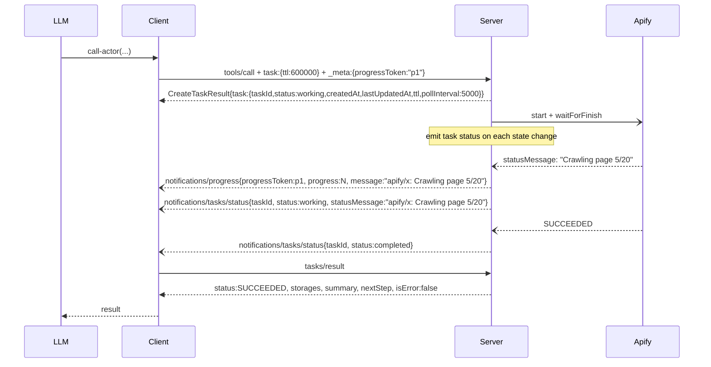

# V4 — `call-actor` redesign (RFC)

Status: locked contract, ready for product + tech review and implementation.
Audience: PM and tech lead. No prior reading required — this document is self-contained.

## Summary

`call-actor` is the entrypoint MCP clients use to run Apify Actors. Today its response is wide and inconsistent: dataset items inline in sync mode, just a `runId` in async, free-form English `instructions` text for the LLM, no progress notifications on long runs, and a cancellation path that leaves the underlying Apify run executing. The unevenness costs LLMs tool calls, produces silent failures (empty dataset reads on nested fields, missed task progress), and bills users for runs they thought they cancelled.

V4 defines a single canonical response shape returned by `call-actor` and `get-actor-run` regardless of mode (sync, task, wait-timeout). The shape mirrors Apify's storage API for familiarity, adds a structured `summary` / `nextStep` pair the LLM can act on directly, and is paired with four substantive companion changes:

1. `get-dataset-items` becomes the canonical retrieval tool — auto-flattens dot-notation fields. Storage IDs the agent needs (`datasetId`, `keyValueStoreId`) are surfaced in `storages.*.id` and embedded directly in the response's `nextStep` text, so the agent can act without parsing `structuredContent`.
2. `abort-actor-run` is promoted into the actor workflow.
3. `get-key-value-store-record` is promoted into the actor workflow; the response surfaces the list of KV store keys so the agent can fetch what it needs.
4. Task mode gains real push notifications (`notifications/tasks/status` on every state change) and real cancellation (cancel actually aborts the Apify run).

**The public tool name stays `call-actor`.** The cleaner name `run-actor` is a separate, later migration — this PR already changes too much to add a name change on top.

## Goals

- **One canonical shape** returned by `call-actor` and `get-actor-run` — same fields across sync, task mode, terminal, and non-terminal cases.
- **Two-call workflow.** Call returns shape and identifiers; agent decides whether to fetch items via `get-dataset-items` or KV records via `get-key-value-store-record`. No server-side previews — predictable token cost.
- **No silent failures on field selection.** Server emits dot-notation paths; retrieval auto-flattens.
- **Push notifications** for task progress.
- **Real cancellation.**
- **KV-only actor support** — keys listed in the response; agent fetches via `get-key-value-store-record`.
- **All 8 Apify run states** covered by templates and clients.

## Non-goals (deliberate)

- **Rename `call-actor` → `run-actor`** in this PR. Deferred to a separate migration.
- **Convert direct actor tools** (e.g. `apify--rag-web-browser`) to the canonical shape. Separate PR.
- **Inline dataset items or KV record bodies.** The response carries shape and identifiers only; the agent fetches data through `get-dataset-items` or `get-key-value-store-record`. Predictable token cost; the agent decides what to retrieve.
- **Generated JSON Schema in the response.** Today's `schema` field (inferred from items) is dropped. The dot-notation `fields` array tells the LLM what's there.
- **Redesign the `actor: "name:tool"` MCP-server pass-through route.** This route still returns the remote MCP tool's verbatim result; v4 explicitly carves it out but doesn't modify it.

## Design principles

1. **Apify shape fidelity.** Field names in `storages.dataset` / `storages.keyValueStore` mirror `apify-client.Dataset` / `KeyValueStore`. Timestamps become ISO 8601 strings (the only type-level departure). This means anyone who's read Apify docs already knows the field semantics.
2. **The LLM is a first-class consumer.** `summary` (past) and `nextStep` (one primary action) are part of the contract. Templates per status are locked, not free-form.
3. **Hide footguns from the LLM.** Server translates Apify slash-notation to dot-notation. `get-dataset-items` auto-flattens parents when fields contain dots. The LLM never sees the Apify-API edge cases that bit it before.
4. **Run status is observation, not tool failure.** `isError: true` is reserved for tool-side failures (auth, network, Zod validation). `FAILED` / `ABORTED` / `TIMED-OUT` are observed run outcomes, returned with `isError: false`.
5. **Push state changes, fall back to poll.** Task mode emits `notifications/tasks/status` on every state change. Per the MCP spec the notification is `MAY` (clients must not depend on it), so SDK clients also poll `tasks/get` at the task's `pollInterval` — the push is a UX win, not a transport-keepalive mechanism.
6. **Cancellation is propagation, not bookkeeping.** `tasks/cancel` aborts the in-flight Apify run, not just the task store entry.
7. **Server returns shape, agent fetches data.** No server-side previews of dataset items or KV record bodies. The response carries identifiers and key/field lists; the agent calls `get-dataset-items` or `get-key-value-store-record` when it needs values. Truncation of the metadata itself (e.g. capped key list) is observable through a count field.

## Locked decisions

| ID | Decision |
|---|---|
| **T1** | `storages` is a subset of the Apify storage API: same field names as `apify-client.Dataset` and `KeyValueStore`, but timestamps are ISO 8601 strings, and fields that are required upstream are optional here when not yet known. We omit security/identity fields (`userId`, `username`, `urlSigningSecretKey`, `generalAccess`, `*PublicUrl`, `actId`, `actRunId`) plus redundant `accessedAt`. We add two fields: `storages.keyValueStore.keys` (string array, capped at 50 names) and `storages.keyValueStore.keyCount` (total key count). The dataset block carries `fields` (dot notation) but no item samples. |
| **T2** | `summary` describes the past. `nextStep` prescribes one primary action. Both camelCase to match the rest of the response. |
| **R1** | Emit `notifications/tasks/status` on every task state change (start → working, on `statusMessage` change, on terminal). No heartbeat: in task mode `tools/call` returns immediately with `CreateTaskResult`, so there is no held-open request to time out, and the SDK client falls back to `tasks/get` polling per spec. `notifications/progress` already emits today on actor state change; only `tasks/status` was missing. |
| **R4** | Keep `call-actor`; defer the `run-actor` rename. The current name is referenced across the public repo, internal repo tests, UI constants, examples, docs, and the MCP Apps widget wiring; combining identity rename with this contract change would make regressions hard to isolate. Plan rename as a separate migration once this contract is stable. |
| **Q2** | `get-actor-run` mirrors `call-actor`'s canonical shape, including `storages.dataset.fields` and `storages.keyValueStore.{keys,keyCount}` when available. |
| **Q3** | `get-dataset-items`, `get-key-value-store-record`, and `abort-actor-run` become available in actor-running workflows through loader auto-injection. Default categories stay unchanged. `get-actor-output` remains available for one minor cycle, deprecated, ordered after `get-dataset-items`. |
| **Q4** | Slash-to-dot translation is handled by the server for `storages.dataset.fields`. `get-dataset-items` auto-flattens any parent referenced in dot-notation `fields`. Explicit `flatten` arg remains as a diagnostic override. The LLM never sees slashes and never has to compute a flatten set. |
| **Q5** | `isError` is `false` whenever we observe any terminal actor status (`SUCCEEDED`, `FAILED`, `ABORTED`, `TIMED-OUT`). Task mode lands in `status: completed` for observed actor terminal states. Task `status: failed` is reserved for tool-side failures (auth, validation, network, server). |
| **Q6** | Storage tools stay single-purpose: `get-dataset-items` requires `datasetId`, `get-key-value-store-record` requires `keyValueStoreId`. The canonical response surfaces both IDs under `storages.*.id` and `nextStep` interpolates them verbatim, so text-mode clients still see one self-contained instruction. (Earlier draft accepted `runId` as an alternative; dropped to avoid a two-mode tool surface and a hidden run-fetch round-trip.) |
| **Q7** | The response does not inline KV record bodies. Instead `storages.keyValueStore.keys` lists up to 50 key names with `keyCount` reflecting the total. The agent fetches any record it wants via `get-key-value-store-record`. |
| **Q8** | Status enum is the full Apify set: `READY | RUNNING | TIMING-OUT | TIMED-OUT | ABORTING | ABORTED | SUCCEEDED | FAILED`. `ABORTING` and `TIMING-OUT` pass through with their own `summary` and `nextStep` templates. |
| **Q9** | `waitSecs` is capped at 0–45 on both `call-actor` and `get-actor-run`. Default 30 on `call-actor`, 0 on `get-actor-run`. The 45 s ceiling stays safely under the 60 s tool-call timeout that several MCP clients impose; longer waits are agent-driven via repeated `get-actor-run` polls. |

## What an LLM sees on a successful call

```json
{
  "responseVersion": "v4",
  "runId": "ABCD1234",
  "actorId": "abc...",
  "actorName": "apify/rag-web-browser",
  "status": "SUCCEEDED",
  "startedAt": "2026-04-29T14:00:00.000Z",
  "finishedAt": "2026-04-29T14:00:22.000Z",
  "stats": { "runTimeSecs": 22, "computeUnits": 0.04, "memMaxBytes": 268435456 },
  "storages": {
    "dataset": {
      "id": "dataset-xyz",
      "itemCount": 47,
      "fields": ["crawl.httpStatusCode", "metadata.url", "markdown"],
      "stats": { "writeCount": 47, "storageBytes": 152340 }
    },
    "keyValueStore": {
      "id": "kv-xyz",
      "keyCount": 1,
      "keys": ["INPUT"]
    }
  },
  "summary": "SUCCEEDED in 22s. 47 items; 3 fields available.",
  "nextStep": "Use get-dataset-items with datasetId=dataset-xyz and limit=20 to fetch items (47 total). Available fields (dot notation): crawl.httpStatusCode, metadata.url, markdown — pass via fields=\"...\" to project. Preview with limit=3."
}
```

The LLM acts on `nextStep` directly. It already knows the row count, the field shape, and the run identifiers — enough to either fetch items or report status to the user without a third "what does this mean" call.

## Canonical response shape

Returned by `call-actor` and `get-actor-run` once Apify has created a run. Pre-run failures (validation, auth, network) use the standard MCP error response path and do not conform to this shape.

```ts
{
  responseVersion: "v4",
  runId: string,
  actorId: string,                 // stable Apify actor ID from the run record; always present
  actorName?: string,              // canonical "username/actor-name" when resolvable; falls back to caller-provided name on call-actor; may be omitted on get-actor-run if actor record fetch fails
  status: "READY" | "RUNNING" | "TIMING-OUT" | "TIMED-OUT"
        | "ABORTING" | "ABORTED" | "SUCCEEDED" | "FAILED",
  statusMessage?: string,          // pass-through from Apify run.statusMessage
  exitCode?: number,               // actor process exit code; populated for terminal states (especially FAILED)
  startedAt?: string,
  finishedAt?: string,
  stats?: {
    runTimeSecs?: number,
    computeUnits?: number,
    memMaxBytes?: number,
  },

  storages: {
    dataset: {
      id: string,
      name?: string,
      title?: string,
      createdAt?: string,
      modifiedAt?: string,
      itemCount?: number,
      cleanItemCount?: number,
      fields?: string[],           // dot notation, e.g. ["crawl.httpStatusCode", "searchResult.title"]
      stats?: {
        readCount?: number,
        writeCount?: number,
        deleteCount?: number,
        storageBytes?: number,
      },
    },
    keyValueStore: {
      id: string,
      name?: string,
      title?: string,
      createdAt?: string,
      modifiedAt?: string,
      stats?: {
        readCount?: number,
        writeCount?: number,
        deleteCount?: number,
        listCount?: number,
        storageBytes?: number,
      },
      keyCount?: number,           // total number of keys in the store
      keys?: string[],              // up to 50 key names; if keys.length < keyCount the list is truncated
    },
  },

  summary: string,
  nextStep: string,
}
```

`_meta` continues to carry usage data under the namespaced key `com.apify/ActorRun` (i.e. `_meta["com.apify/ActorRun"] = { usageTotalUsd, usageUsd }`), per the MCP `_meta` rule that non-reserved keys be namespaced. This convention was introduced on master in #775 and is unaffected by this redesign.

Field-population notes:

- `itemCount` may briefly lag (Apify's pagination counter is eventually consistent, ~5 s post-terminal). When `itemCount: 0` immediately post-terminal but a `listItems({ limit: 1 })` call returns ≥1 item, server re-fetches and uses the larger value.
- `actorId` is the stable identifier; prefer it for any code path that pins a specific actor. `actorName` is for display only.
- `actorName` falls back to the caller's `actor` argument on `call-actor` when the actor record fetch fails. On `get-actor-run` there is no caller-provided name, so `actorName` may be omitted entirely.
- `statusMessage` mirrors `run.statusMessage` verbatim; surfacing it at the top level lets clients render it without re-fetching.
- `exitCode` is most useful for `FAILED`. `SUCCEEDED` runs typically have `0`; aborts may not populate it.
- `fields` is in dot notation. Server reads Apify's slash form and rewrites `/` to `.` before returning.
- `keys` and `keyCount` are populated for terminal states by listing the run's default key-value store. The server caps `keys` at 50 entries; when `keyCount > keys.length`, the list is truncated and the agent should ask for specific keys directly via `get-key-value-store-record`. Both fields may be omitted on non-terminal states or if the listKeys call fails.

## Status templates

Every status returns a concrete `summary` and one primary `nextStep`. Templates use `${...}` placeholders the server fills in.

| Status | summary | nextStep |
|---|---|---|
| READY | `"READY. Run ${runId} was created but has not started."` | `"Use get-actor-run with runId=${runId} and waitSecs=10 to wait for progress."` |
| RUNNING | `"RUNNING for ${elapsedSecs}s. ${statusMessage \|\| 'In progress'}."` | `"Use get-actor-run with runId=${runId} and waitSecs=10 to poll for completion."` |
| TIMING-OUT | `"TIMING-OUT after ${elapsedSecs}s. ${statusMessage \|\| 'Run-time limit reached; cleanup in progress'}."` | `"Use get-actor-run with runId=${runId} and waitSecs=10 to observe terminal state."` |
| ABORTING | `"ABORTING after ${elapsedSecs}s. ${statusMessage \|\| 'Cancellation in progress'}."` | `"Use get-actor-run with runId=${runId} and waitSecs=10 to observe terminal state."` |
| SUCCEEDED, dataset has items | `"SUCCEEDED in ${runTimeSecs}s. ${itemCount} items; ${fieldCount} fields available."` | `"Use get-dataset-items with datasetId=${storages.dataset.id} and limit=20 to fetch items (${itemCount} total). Available fields (dot notation): ${storages.dataset.fields.join(', ')} — pass via fields=\"...\" to project. Preview with limit=3."` |
| SUCCEEDED, dataset empty + KV has keys | `"SUCCEEDED in ${runTimeSecs}s. Output written to key-value store (${keyCount} keys)."` | When `keys` includes `OUTPUT`: `"Use get-key-value-store-record with keyValueStoreId=${storages.keyValueStore.id} and recordKey=\"OUTPUT\" to read the main output. Other keys: ${keys.filter(k=>k!=='OUTPUT').join(', ') \|\| 'none'}."` Otherwise: `"Use get-key-value-store-record with keyValueStoreId=${storages.keyValueStore.id} and one of these keys (as recordKey): ${storages.keyValueStore.keys.join(', ')}."` |
| SUCCEEDED, no dataset items, no KV keys | `"SUCCEEDED in ${runTimeSecs}s. No dataset items and no key-value records were found."` | `"Inspect statusMessage and stats in this response; if the missing output was unexpected, re-run call-actor with adjusted input."` |
| FAILED | `"FAILED after ${runTimeSecs}s${statusMessage ? ': ' + statusMessage : ''}."` | `"Diagnose using statusMessage and exitCode in this response; re-run call-actor with adjusted input if the cause is fixable."` |
| ABORTED | `"ABORTED after ${runTimeSecs}s${statusMessage ? ': ' + statusMessage : ''}."` | `"Use call-actor again if you want to rerun the actor."` |
| TIMED-OUT | `"TIMED-OUT after ${runTimeSecs}s."` | `"Use get-dataset-items with datasetId=${storages.dataset.id} and limit=20 to fetch any partial output (${itemCount ?? 0} items written). Available fields: ${storages.dataset.fields?.join(', ') \|\| 'none'}."` |

`elapsedSecs` is `(now - startedAt)` for non-terminal states. `runTimeSecs` comes from `stats.runTimeSecs` for terminal states. `fieldCount` is `storages.dataset.fields?.length ?? 0`.

A text-mode response (for clients that don't read structured content) carries `${summary}`, `${nextStep}`, and the run identifiers — verbatim, no inlined item or record bodies. The agent fetches data via `get-dataset-items` or `get-key-value-store-record` exactly as in structured mode.

## Behavior contracts

### Synchronous (default mode)

`call-actor` accepts `waitSecs` (0–45, default 30). Behavior:

- `waitSecs: 0` returns after `actor.start(...)` with status `READY` or `RUNNING`.
- `waitSecs ∈ [1, 45]` waits up to that many seconds for terminal status, then returns whatever it observed.
- The 45 s ceiling stays under the 60 s tool-call timeout that several MCP clients impose; without it those clients would close the call before the server returns.
- Long-running actors return non-terminal status with a polling `nextStep`. The server does not block indefinitely on the LLM's behalf.
- Note: Apify's start endpoint caps API-side waiting at 60 s. Server uses `start` followed by `waitForFinish({ waitSecs })`, never `waitForFinish` inside `start` options.

### Progress notifications during sync waits

Whenever the server is actively waiting for a run to reach terminal state — inside `call-actor` with `waitSecs > 0` or inside `get-actor-run` with `waitSecs > 0` — and the caller passes `_meta.progressToken` on the request, the server emits `notifications/progress` with that token on each Apify `run.statusMessage` change observed during the wait window.

This recovers the live-status feel for the async-then-poll flow: the LLM fires `call-actor` with `waitSecs: 0`, gets a `RUNNING` response with a polling `nextStep`, then calls `get-actor-run` with a real `waitSecs` and a `progressToken`, and receives push-style updates ("Crawling page 5/20" → "Crawling page 6/20" → ...) while the wait is in flight. Without `progressToken` the wait emits nothing — agents that don't want the notifications simply omit it.

Implementation reuses the existing `ProgressTracker` (`src/utils/progress.ts`) that today only wires into `call-actor`. v4 wires the same tracker into the `get-actor-run` wait loop. Notification format is unchanged: same `progressToken` echoed back, same `_meta` shape, same `io.modelcontextprotocol/related-task` attachment when invoked under task augmentation. This is purely opt-in and does not affect tool-result content.

### Task mode

Task mode is selected when the client passes `task: {...}` on `tools/call`. The server returns `CreateTaskResult` immediately and runs the underlying tool in the background until terminal or cancelled.

- `waitSecs` and `async` from the args are **overridden** at the task boundary. The task always waits until terminal — honoring `async: true` would let the task complete the moment the actor started, which is wrong. If the caller sends both `task: {...}` and `async: true`, log a deprecation event but still wait until terminal.
- Push notifications: `notifications/tasks/status` emits on every state change (start → working, on `statusMessage` change, on terminal). No heartbeat — `tools/call` in task mode returns immediately, and per spec `notifications/tasks/status` is `MAY` so clients must not depend on it; the SDK client polls `tasks/get` regardless.
- `tasks/result` returns the canonical shape (same as sync mode).
- See **Cancellation** below.

### MCP-server Actor pass-through

`call-actor` accepts `actor: "username/name:mcpToolName"` for invoking specific tools on Apify Actors that are themselves MCP servers (e.g. `apify/actors-mcp-server:fetch-apify-docs`). When `mcpToolName` is non-empty, the call delegates to the remote MCP server and returns its tool result verbatim.

This route is **excluded from the canonical shape**. It does not produce a run, has no `runId` / `storages` / `summary` / `nextStep`. `_meta` usage attribution on this path follows existing behavior — v4 does not change it. Task wrapping is allowed (the task tracks the remote MCP request as its work); cancellation aborts the in-flight remote MCP request, not an Apify run.

The tool description must explain both routes side by side so the LLM does not assume the canonical shape is always returned.

## isError and task lifecycle

- **`isError: false`** whenever any terminal actor status is observed (`SUCCEEDED`, `FAILED`, `ABORTED`, `TIMED-OUT`). The tool succeeded in observing the run; the actor outcome lives in `status`.
- **`isError: true`** is reserved for tool-side failures: invalid input (Zod), Apify auth failure, network unreachable, server crash. These all return before any actor terminal status is observed.

In task mode:

- Task → `status: completed` whenever an actor terminal status is observed (regardless of which terminal). The actor outcome flows through `status` in the result.
- Task → `status: failed` only for tool-side failures. Because the MCP task result shape has no dedicated reason field, the failure reason is stored in `task.statusMessage` so clients can read it via `tasks/get`.
- Task → `status: cancelled` when `tasks/cancel` is invoked. The cancel handler aborts the in-flight Apify run.

## Cancellation

Required behavior: `tasks/cancel` aborts the underlying Apify run, not just the task entry.

Spec-MUST behaviors per the [MCP tasks specification](https://modelcontextprotocol.io/specification/2025-11-25/basic/utilities/tasks):

- The task **MUST** transition to `cancelled` **before** the `tasks/cancel` response is sent. The Apify run abort is allowed to propagate asynchronously after; the response must not block on it.
- `tasks/cancel` for a task already in a terminal status (`completed`, `failed`, `cancelled`) **MUST** return JSON-RPC error `-32602` (Invalid params) with a message naming the current status.

Architectural shape: the server holds a per-task in-flight reference (an `AbortController` plus, once known, the `runId`). When `tasks/cancel` fires, the server transitions the task to `cancelled`, aborts the controller, sends the spec-required response, and — as a safety net for any race where the run was created but the controller didn't reach it in time — also aborts the run by `runId`. The reference is cleared on terminal transition.

Two race conditions are explicitly accounted for:

1. **Cancel before run starts.** Aborting the controller while `actor.start(...)` is still in flight does not prevent the run from being created in the brief race window. The implementation aborts the run as soon as `start` returns. The test contract is "no un-aborted orphan run remains" — not "no run is ever created."
2. **Cancel after start, before terminal.** Standard case. The controller signal reaches the in-flight wait-for-finish loop, which calls `run.abort()`.

## Truncation policies

### `keyValueStore.keys`

For terminal states, the server lists the run's default key-value store via Apify's `listKeys` endpoint and includes the result in `storages.keyValueStore`:

- `keyCount` — total number of keys reported by Apify.
- `keys` — first 50 key names in the order Apify returns them.

When `keyCount > keys.length`, the list is truncated. The agent should fetch any specific key by name via `get-key-value-store-record` rather than asking the server to enumerate further.

If the listKeys call fails or the run has no default key-value store, both fields are omitted. The server never inlines the bodies of any record — `OUTPUT` or otherwise. Bodies are agent-driven through `get-key-value-store-record`.

## Tool surface

| Tool | Status | Behavioral notes |
|---|---|---|
| `call-actor` | Canonical | Accepts `actor`, `input`, `waitSecs?` (0–45, default 30), `callOptions?`. Declares `execution.taskSupport: "optional"` per MCP spec. |
| `run-actor` | Deferred | Not implemented in this PR. Plan as a separate rename migration. |
| `get-actor-run` | Modified | Adds `waitSecs` (0–45, default 0 to preserve current immediate-poll behavior). Returns the canonical shape. When `waitSecs > 0` and the caller passes `_meta.progressToken`, the server emits `notifications/progress` on each `run.statusMessage` change during the wait — see "Progress notifications during sync waits" below. |
| `get-dataset-items` | Promoted in actor workflows | Requires `datasetId`. Defaults `limit` to 20. Auto-flattens dot-notation `fields`. Explicit `flatten` remains as a diagnostic override. |
| `get-key-value-store-record` | Promoted in actor workflows | Requires `keyValueStoreId` and `recordKey`. Parameter name `recordKey` matches the existing tool schema (kept for backward compatibility). |
| `abort-actor-run` | Promoted in actor workflows | Auto-surfaced when actor-running tools are present. |
| `get-actor-output` | Deprecated | Kept for one minor cycle. Description prefixed `DEPRECATED:`; points to `get-dataset-items` for dataset items and `get-key-value-store-record` for KV records. |

Auto-injection policy: when `call-actor`, a direct actor tool, or `add-actor` is present in the active tool set, the loader also surfaces `get-actor-run`, `get-dataset-items`, `get-key-value-store-record`, and `abort-actor-run`. `get-actor-output` is kept injected for one minor cycle, ordered after `get-dataset-items`.

### `get-dataset-items` — substantive change

The behavioral change that actually closes the silent-failure gap:

- Requires `datasetId` (single mode). The agent gets `datasetId` from `storages.dataset.id` on the canonical response, or interpolated directly into `nextStep` for text-mode clients.
- When `fields` contains dot-notation paths (e.g. `"metadata.url"`), the server derives the unique top-level parent prefixes and passes them as `flatten` to Apify automatically. The LLM never has to know about Apify's `flatten` parameter.
- If the caller provides explicit `flatten`, it overrides the auto-derivation (diagnostic escape hatch).
- Default `limit: 20` when omitted, to prevent inadvertent large reads. The agent can opt for more by passing an explicit `limit`.

This is the change that lets us deprecate `get-actor-output`: once `get-dataset-items` handles dot-notation by default, the local-projection workaround is no longer needed.

### `get-key-value-store-record` — promoted

The KV-only-actor case (and any actor that writes auxiliary records) needs a first-class fetch path now that the response no longer inlines record bodies.

- Requires `keyValueStoreId` and `recordKey`. The parameter is named `recordKey` to match the existing tool schema; v4 does not rename it.
- The agent gets `keyValueStoreId` from `storages.keyValueStore.id` on the canonical response, or interpolated directly into `nextStep` for text-mode clients.
- Auto-surfaced in actor workflows so the LLM can act on `nextStep` without the storage tool category being explicitly enabled.

The agent's path for KV-only output is: `call-actor` returns `storages.keyValueStore.{id,keyCount,keys}` → `nextStep` points at `get-key-value-store-record(keyValueStoreId=${storages.keyValueStore.id}, recordKey="OUTPUT")` → agent fetches the body when (and only when) it actually wants it.

## `callOptions` accepted keys

`call-actor` accepts these `callOptions`:

| Key | Type | Why |
|---|---|---|
| `timeout` | number, seconds | Actor run-time cap |
| `memory` | number, MB | Actor memory allocation |
| `build` | string | Specific actor build |
| `maxItems` | number | Charge cap for pay-per-result actors |
| `maxTotalChargeUsd` | number | Charge cap for pay-per-event actors |

Unknown keys are silently dropped (Zod default object behavior). The earlier draft proposed strict rejection with per-key rationales for SDK-internal options like `waitForFinish` / `webhooks` / `forcePermissionLevel`; this was dropped because the only caller is an LLM, which has no schema for those keys and won't send them. If unknown keys ever surface in telemetry, revisit then.

## Input compatibility

Canonical input:

```ts
{
  actor: string,                        // "username/name" or "username/name:mcpToolName"
  input: Record<string, unknown>,       // required object; pass {} for actors with no input
  waitSecs?: number,                    // 0-45, default 30 for call-actor
  callOptions?: { timeout?, memory?, build?, maxItems?, maxTotalChargeUsd? },
}
```

`input` stays required, matching today's behavior.

Deprecated fields accepted for one minor cycle so old hardcoded callers do not fail immediately:

- `async: true` maps to `waitSecs: 0`.
- `async: false` maps to the default `waitSecs`.
- Both `async` and `waitSecs` together: rejected as ambiguous.
- `previewOutput` accepted but ignored. The response no longer inlines item or record samples, so the original token-risk reason for disabling previews no longer applies — previews are agent-driven via `get-dataset-items` (`limit: 3`) or `get-key-value-store-record`.

Deprecated fields are not promoted in the tool description.

## End-to-end flows

### Tier A — synchronous, fast actor

```mermaid
sequenceDiagram
  participant LLM
  participant Server
  participant Apify
  LLM->>Server: call-actor(actor, input, waitSecs:30)
  Server->>Apify: actor.start(input, callOptions)
  Server->>Apify: run.waitForFinish({ waitSecs:30 })
  Apify-->>Server: SUCCEEDED at 10s
  Server->>Apify: dataset.get (fields, itemCount) + keyValueStore.listKeys (keys, keyCount)
  Note over Server: server translates fields slash->dot;<br/>caps keys at 50
  Server-->>LLM: status:SUCCEEDED, storages.dataset:{id,itemCount,fields}, storages.keyValueStore:{id,keyCount,keys}, summary, nextStep
  LLM->>Server: get-dataset-items(datasetId, fields:"metadata.url,markdown", limit:20)
  Note over Server: auto-flatten parent "metadata"<br/>before calling Apify
  Server-->>LLM: items:[...]
```

### Tier B — task mode, long-running actor



## Migration impact

| Change | Impact |
|---|---|
| Response: dataset id moves to `storages.dataset.id` | Hard. `call-actor` data response had `datasetId` at top level; `get-actor-run-widget` had `dataset.datasetId` nested. Both move to `storages.dataset.id`. |
| Response: `items` removed from `call-actor` / `get-actor-run` | Hard. Agent fetches via `get-dataset-items`. |
| `previewItems` removed; no item samples in the response | Hard. Agent fetches a preview via `get-dataset-items` with `limit: 3`. |
| `instructions` → `summary` + `nextStep` | Hard. Different semantics and names. |
| `schema` field dropped; `fields` returned in dot notation | Hard. JSON Schema generation is removed from this path. |
| `call-actor` default wait changes to 30 s; `waitSecs` capped at 45 | Hard for long-running actors. They now return non-terminal with a polling `nextStep` instead of blocking indefinitely. The 45 s ceiling stays under the 60 s tool-call timeout common to several MCP clients. |
| `async` parameter deprecated but accepted | Soft. `async: true` maps to `waitSecs: 0`; remove next minor cycle. |
| `previewOutput` deprecated but accepted | Soft. Ignored — previews are agent-driven now. Remove next minor cycle. |
| `get-actor-output` deprecated | Soft for one cycle. Still callable; description points to `get-dataset-items` (dataset items) and `get-key-value-store-record` (KV records). |
| `get-dataset-items` auto-flattens dot-notation `fields` | Soft. Explicit `flatten` still works as override. |
| `get-key-value-store-record` auto-surfaced in actor workflows | Soft. Additive. Closes the KV-only-actor path now that record bodies are not inlined. |
| `abort-actor-run` auto-surfaced in actor workflows | Soft. Additive. |
| `get-actor-run` adds `waitSecs`, default 0, capped at 45 | Soft. Existing callers keep immediate-poll behavior. |
| `get-actor-run` emits `notifications/progress` during the wait when `_meta.progressToken` is provided | Soft. Additive, opt-in. Reuses the same `ProgressTracker` pattern wired into `call-actor` today. |
| `isError` unified | Soft for tool-call semantics, but clients using task `status: failed` to detect actor failure must read inner `status` instead. |
| `storages.keyValueStore.{keys,keyCount}` added | Soft. Additive. Replaces the inline-OUTPUT path that earlier drafts considered. |
| `responseVersion: "v4"` added | Soft. Additive. |
| `callOptions` accepts three new keys (`build`, `maxItems`, `maxTotalChargeUsd`) | Soft. Additive. Unknown keys keep being silently dropped. |
| Status enum widened to all 8 Apify states | Soft. Additive. |
| `actorId` added; `actorName` becomes optional | Soft (additive). `actorName` was never present on the shipped `call-actor` shape and was already optional on `get-actor-run`. |
| `statusMessage` and `exitCode` added at top level | Soft. Additive. |
| `tasks/cancel` now propagates to `run.abort()` | Soft (bug fix). The current behavior — orphaned runs continuing after cancel — is an oversight, not load-bearing semantics. |
| Task mode forces `waitSecs` to wait-until-terminal and ignores `async: true` | Soft. Additive defensive behavior. |
| `actor: "name:tool"` MCP-server pass-through is excluded from the canonical shape | No new behavior; the doc just admits the carve-out exists. |

Breaking changes must be coordinated with `apify-mcp-server-internal` before merge. The internal repo is spared the tool-name migration (no rename), but **not** the contract migration:

- Response-shape readers must migrate from `datasetId`, `items`, `previewItems`, and `instructions`. Item samples are no longer in the response — fetch via `get-dataset-items`.
- Tool-list tests must reflect `get-dataset-items`, `get-key-value-store-record`, and `abort-actor-run` auto-surfacing.
- Any internal code assuming `get-actor-output` is the default retrieval tool must move to `get-dataset-items` (or `get-key-value-store-record` for KV-only output).

## Widget impact

Three apps-mode tools share this canonical shape and must be updated together: the apps-mode `call-actor`, `call-actor-widget`, and `get-actor-run-widget`. Today's widget responses nest under `structuredContent.dataset.{datasetId, previewItems}` (per `src/tools/core/get_actor_run_common.ts`); v4 moves both fields into `structuredContent.storages.dataset.{id, ...}` with no `previewItems` at all. The actor-run widget must:

- Read `storages.dataset.id` (replaces `dataset.datasetId`).
- Drop any read of `dataset.previewItems`. Fetch a small preview (e.g. `limit: 3`) or a full table (`limit: 100`) via `get-dataset-items` with `datasetId` (read from `storages.dataset.id`), depending on widget context.
- Read `storages.keyValueStore.{keyCount,keys}` to render a key list; fetch individual records on demand via `get-key-value-store-record` (parameter is `recordKey`, not `key`).
- Read top-level `statusMessage` and `exitCode` directly instead of re-fetching.
- Poll `get-actor-run` with `waitSecs: 0` so widget refreshes do not block.
- Accept the old shape for one minor cycle only if cheap to do so. Do not add complex compatibility branches.

## Risks and open questions

- **`waitSecs` cap at 45 s.** Chosen against the 60 s tool-call timeout common to several MCP clients (this cap applies to sync mode where `tools/call` is held open; task mode is unaffected because `tools/call` returns immediately). Tune downward if a client surfaces a tighter ceiling; tune upward only with telemetry confirming everyone in scope is comfortably above the new value.
- **Cancellation race window.** Cancel-before-start does create a brief Apify run that is then aborted. We accept this and assert "no un-aborted orphan." If accounting becomes a problem, the alternative is to delay run creation until after a debounce, which adds latency to the common case.
- **`keys` cap at 50.** Picked as a safe ceiling. Actors that write hundreds of small KV records (rare) will see a truncated list with `keyCount` reflecting the total, and the agent fetches by name. Tune if telemetry shows real actors with 50+ semantically meaningful keys.
- **Free-form `statusMessage`.** Actor authors set it. Some are useful ("Crawling page 5/20"), some are noise. Templates pass it through verbatim; we accept variability rather than try to normalize.
- **`responseVersion` versioning policy.** We bump to `v4`. Future breaking shape changes bump again; additive changes do not. Clients can feature-detect.
- **`abort-actor-run` is intentionally not surfaced as a recovery hint for memory-quota errors.** Nudging the LLM toward "free capacity" risks aborting unrelated in-flight runs the user cares about. The recovery hint points at `callOptions.memory` and "wait for current runs to finish" only.

## Out of scope (deliberate deferrals)

- Rename `call-actor` to `run-actor` — separate migration after this contract stabilizes.
- Convert direct actor tools (e.g. `apify--rag-web-browser`) to the canonical shape — separate PR.
- Remove deprecated `async`, `previewOutput`, and `get-actor-output` — next minor cycle.
- `taskSupport` on `get-actor-run` — revisit after task adoption is measured.
- `waitSecs` ceiling tuning — based on real telemetry; 45 s is the conservative starting point.
- Convert MCP-server pass-through (`actor:tool`) to a uniform shape — orthogonal redesign.

## MCP spec compliance

Verified against the live [tasks spec](https://modelcontextprotocol.io/specification/2025-11-25/basic/utilities/tasks) (experimental in 2025-11-25). Server capabilities (`tasks: { list, cancel, requests: { tools: { call } } }`) and `_meta` usage attribution (`usageTotalUsd`, `usageUsd`) carry over unchanged. Constraints v4 must honor:

- **Statuses:** v4 emits `working`, `completed`, `failed`, `cancelled`. `input_required` is intentionally unused (no elicitation). Any observed Apify terminal → task `completed` with `isError: false`; tool-side failure → task `failed` with `isError: true`.
- **`CreateTaskResult` is nested:** `{ task: { taskId, status, createdAt, lastUpdatedAt, ttl, pollInterval? } }`. Flat shapes are non-compliant.
- **`call-actor` declares `Tool.execution.taskSupport: "optional"`** (nested under `execution`). Other v4 tools omit it (default: `forbidden`).
- **`notifications/tasks/status` payload** is the full `Task` object per `TaskStatusNotificationParams = NotificationParams & Task`. The notification is `MAY` per spec; clients must not rely on it (SDK clients fall back to `tasks/get` polling).
- **`io.modelcontextprotocol/related-task` `_meta` key** is a spec MUST on (a) the `CallToolResult` returned via `tasks/result` and (b) progress notifications. (b) is already wired (`src/utils/progress.ts`); (a) is an implementation item this PR adds. Omitted from `tasks/get` / `tasks/list` / `tasks/cancel` and from `notifications/tasks/status` (taskId is in the message structure). Coexists with the namespaced `com.apify/ActorRun` usage block under the same `_meta` record.
- **`tasks/cancel` MUSTs:** reject terminal-status tasks with `-32602`; transition the task to `cancelled` before sending the response (Apify abort propagates async — see Cancellation above).

## What we will test

End-to-end behavioral assertions, summarised:

- **Canonical shape** is returned for sync `call-actor` and `get-actor-run` against a representative actor (rag-web-browser).
- **No item or record bodies in the response.** `storages.dataset.fields` and `storages.keyValueStore.{keys,keyCount}` are populated; no `sampleItems` and no inlined record bodies appear under any path.
- **`waitSecs` cap.** Both `call-actor` and `get-actor-run` reject `waitSecs > 45` with a validation error. `waitSecs: 45` is accepted and the call returns within roughly that bound.
- **`get-dataset-items` with dot-notation `fields`** returns nested values without explicit `flatten` (auto-flatten works).
- **`get-key-value-store-record` with `keyValueStoreId`** (read from `storages.keyValueStore.id`) returns the requested record body. Auto-injection: the tool is present in the active tool set whenever `call-actor` is, without explicitly enabling the storage category.
- **KV-only actor**: `storages.keyValueStore.{id,keys}` lists the store ID and keys (including `OUTPUT`); the response carries no record body. The `nextStep` directs the agent at `get-key-value-store-record(keyValueStoreId, recordKey="OUTPUT")` with the store ID interpolated.
- **Task mode** lands in `completed` for an actor that finishes in any terminal state, including `FAILED`.
- **Synthetic infra failure** (invalid actor, sandboxed revoked token) lands in task `failed` and populates `task.statusMessage`.
- **Push notifications**: at least one `notifications/tasks/status` arrives between `tasks/created` and `completed`.
- **Progress on `get-actor-run` waits**: when invoked with `waitSecs > 0` and `_meta.progressToken`, the server emits `notifications/progress` carrying that token on each `run.statusMessage` change observed during the wait. No emissions when `progressToken` is absent.
- **Cancellation**: `tasks/cancel` mid-run results in the underlying Apify run reaching `ABORTED`; task transitions to `cancelled` **before** the cancel response is sent; a `tasks/status: cancelled` notification fires. Cancel-before-start results in an `ABORTED` run (no un-aborted orphan).
- **Cancel of terminal task** is rejected with JSON-RPC error `-32602`, message naming the current status.
- **`_meta.related-task` on `tasks/result`**: the `CallToolResult` returned through `tasks/result` includes `_meta: { "io.modelcontextprotocol/related-task": { taskId } }`. (Progress notifications already covered by existing tests.)
- **`notifications/tasks/status` payload**: every emission contains the full `Task` object (taskId, status, createdAt, lastUpdatedAt, ttl, optional statusMessage/pollInterval).
- **`CreateTaskResult` shape**: `tools/call` with `task: { ttl }` returns `{ task: { taskId, status: "working", ... } }` — nested, not flat.
- **`taskSupport` placement**: `tools/list` reports `call-actor.execution.taskSupport === "optional"`; other v4 tools either omit `execution` or set `taskSupport: "forbidden"`.
- **Task mode override**: `task: {...}` plus deprecated `async: true` does not short-circuit the task; it waits until terminal.
- **MCP-server pass-through**: `actor: "name:tool"` returns the remote MCP tool result, not the canonical shape; `responseVersion` is absent on this path.
- **`callOptions` accept-path**: each of `memory`, `timeout`, `build`, `maxItems`, `maxTotalChargeUsd` passes Zod parsing; `maxItems` is forwarded to `apifyClient.actor(...).start()` end-to-end against `apify/rag-web-browser`.
- **`keys` cap**: a KV store with >50 keys returns the first 50 names with `keyCount` reflecting the total.
- **Apps widget**: reads the new shape and polls with `waitSecs: 0`.

### How we test

End-to-end coverage uses **mcpc against the local stdio build**. mcpc drives the actual MCP server over stdio (no HTTP harness, no UI), so assertions on `responseVersion`, `storages.*`, status templates, and notification streams reflect what real clients receive.

Workflow per code change:

```bash
npm run build
mcpc @stdio restart
mcpc @stdio tools-call call-actor actor:='"apify/rag-web-browser"' input:='{"query":"hello"}' --json | jq '.result.structuredContent'
```

Notes:

- The mcpc bridge is established once per workspace; agents do not need to re-run `mcpc connect`.
- Probes that actually hit the Apify API (everything except validation/auth-failure paths) require a real `APIFY_TOKEN` in the server env; agents must ask the user for one rather than committing or logging it.
- Use `--json` piped through `jq` to assert on response shape. No inline Python.
- Notification-stream tests (`notifications/tasks/status`, progress events) use mcpc's notification capture; the suite-level harness can mirror those assertions for CI.

The behavioural list above maps 1:1 onto mcpc-driven test cases. Programmatic equivalents land in `tests/integration/suite.ts` — the shared suite used by both stdio and streamable-HTTP transports — and run via `npm run test:integration` with a real token. New cases must go in `suite.ts`, not in standalone files. Integration runs are humans/CI only; agents drive mcpc instead.
